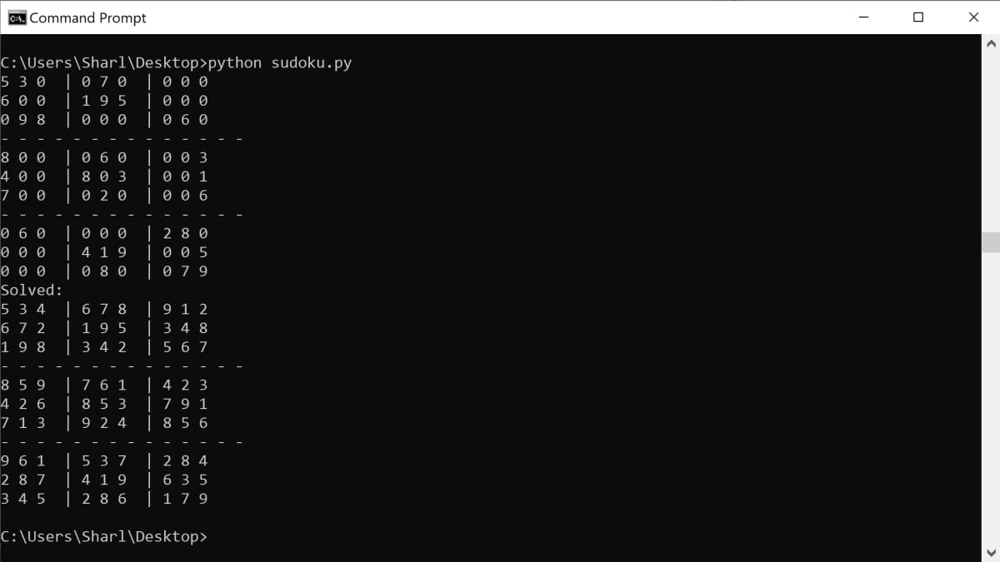

# sudoku-puzzle-solver
This is a Python script that solves a sudoku puzzle

## To Run

* Navigate to the sudoku-puzzle-solver folder in the command line or terminal.
* Run the script using the python command: python sudoku.py

## Example

